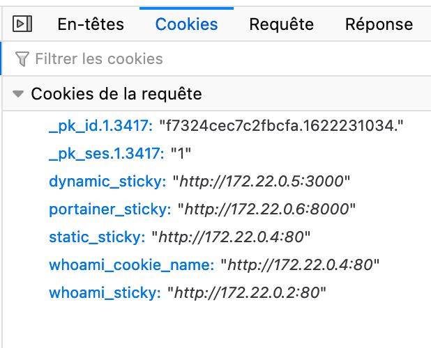
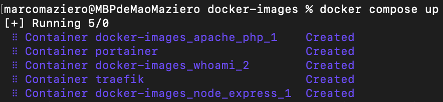
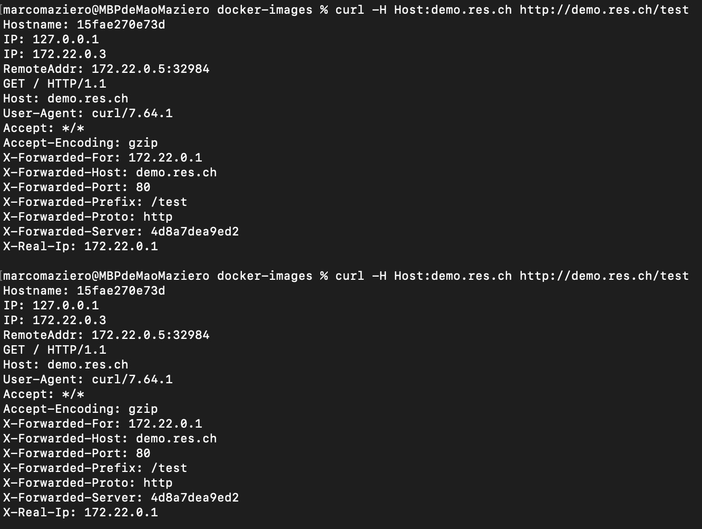
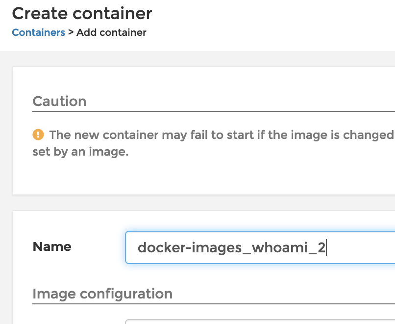
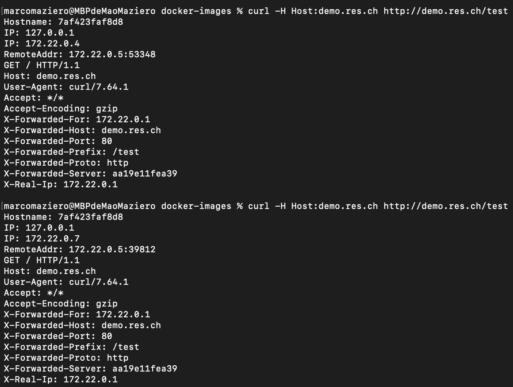
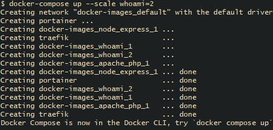
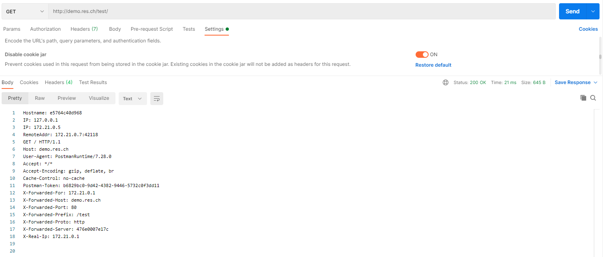
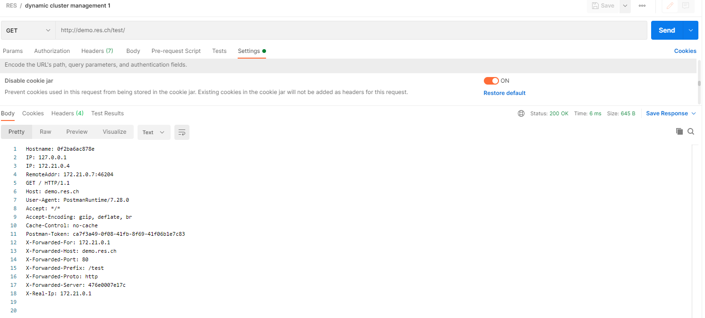
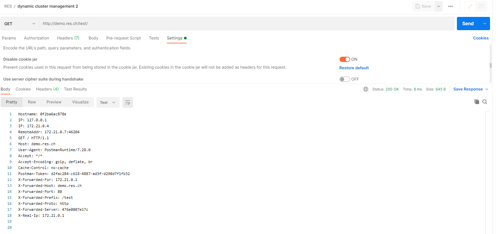

# RES | Laboratoire infrastructure HTTP

## 1 - Serveur statique avec Apache httpd

### Récupération et lancement de l'image Docker Apache httpd avec php

L'image Docker httpd avec php a été récupérée sur [Docker hub](https://hub.docker.com/_/php/) à l'adresse de l'image php, qui offre une version d'Apache httpd avec php configuré.

#### Lancement sans image Docker

Un premier lancement de l'image a été fait pour tester le container.  La commande suivante permet de lance le container sans image docker :

```sh
docker run -d -p 9090:80 php:7.2-apache
```

Le port 80, ouvert dans le container a été mappé sur le port 9090 de la machine hôte.

Il est donc possible de se connecter au container en telnet sur l'adresse 127.0.0.1:9090

#### Lancement avec image Docker

Pour lancer l'image, un Dockerfile a été crée avec les instructions suivantes :

```dockerfile
FROM php:7.2-apache
COPY content/ /var/www/html/
```

- La première ligne spécifie l'image à utiliser

- La deuxième ligne copie le contenu du dossier `content/` dans le dossier `/var/www/html/` à l'intérieur du container
  - Le dossier `content/` contient donc les fichiers source du site web statique

##### Build de l'image docker du serveur

Commande de build à exécuter dans le dossier du Dockerfile : 

```bash
docker build -t res/apache_php .
```

- le `-t [tag]` spécifie le nom (tag) de l'image à construire

- le `.` spécifie que l'image sera construite depuis le dossier courant

Cette commande se trouve dans un fichier `build-image.sh` au même niveau que le Dockerfile.

##### Run de l'image du serveur dans un container

Commande à lancer pour démarrer un container : 

```bash
docker run -d -p 9090:80 res/apache_php
```

- `-d` permet de lancer le serveur en arrière plan
- `-p 9090:80` permet de mapper le port 9090 du host au port 80 du container
- `res/apache_php` correspond au tag/nom de l'image depuis laquelle on crée un container

Cette commande se trouve dans un fichier `run-container.sh` au même niveau que le Dockerfile.

Pour ouvrir un terminal à l'intérieur du container, il est possible d'utiliser la commande :

```bash
docker exec -it [nomDuContainer] /bin/bash
```

### Copie ou lien avec un dossier du host

Le serveur web apache qui tourne dans le container affiche le contenu html présent dans le dossier `/var/www/html`.

Il est possible de placer des fichiers dans ce dossier depuis la machine hôte de deux façons différentes.

#### La copie d'un dossier local

La première variante consiste à copier tout le contenu d'un dossier local dans le dossier `/var/www/html` du container **à sa création**. Cela est fait dans le dockerfile avec la ligne :

```
COPY content/ /var/www/html/
```

Le contenu une fois copié ne sera pas mis à jour en cas de  modification dans le dossier local, et en cas de redémarrage du  container, toutes les modifications faites aux fichiers html à  l'intérieur du container seront perdues !

#### Monter un volume dans le container sur un dossier local

La deuxième variante consiste à monter un volume à l'intérieur du container dans le dossier `/var/www/html` pointant sur un dossier local de la machine hôte. Cela peut être fait lors de la commande run avec l'option `--volume`.

Cela permet de modifier en direct les fichiers dans le dossier local  et ceux-ci seront modifiés dans le dossier du container. Les  modifications ne seront pas perdues à la fermeture du container.

## 2 - Serveur HTTP dynamique avec express.js

### Récupération d'une image docker NodeJS 14.17.0

Un dockerfile avec une image Node.js officielle provenant de Docker Hub à été crée :

```dockerfile
FROM node:14.17.0
COPY src /opt/app
CMD ["node", "/opt/app/index.js"]
```

- La première ligne spécifie l'image à utiliser, l'image de node 14.17.0 (latest)
- La deuxième ligne copie le contenu du dossier `src`  dans le dossier `/opt/app`
- La troisième ligne exécute la commande `node /opt/app/index.js` à l'intérieur du container, ce qui va lancer le script index.js au démarrage de ce dernier.

### Création d'un projet node.js dans src

L'initialisation d'un projet NodeJS peut se faire via la commande :

```bash
npm init
```

Puis installer la dépendance node.js *chance* avec :

```bash
npm install --save chance
```

Cela crée une entrée (une dependance) dans `package.json` ainsi qu'un dossier `node_modules` qui contiendra toutes les dépendances. Ce dossier ne doit pas être mis sur Github car il est assez lourd.

Il reste à créer un fichier index.js dans lequel il est possible d'écrire un simple programme qui affiche un nom aléatoire avec le module `chance` installé précédemment (ceci est juste un test pour voir si la dépendance et le serveur fonctionnent) :

```javascript
var Chance = require('chance')
var chance = new Chance();

console.log("Bonjour " + chance.name());
```

Finalement, ce script peut être lancé avec la commande :

```sh
node index.js
```

Au moment de la connexion au serveur, cela va retourner : 

```
Bonjour  [nom au hasard]
```

Il faut maintenant tester l'exécution du script a l'intérieur du container, pour ce faire, il suffit de build et lancer l'image NodeJS :

```sh
docker build -t res/node_express .
docker run -p 8080:3000 res/node_express
```

Cela va afficher le même résultat que l'étape précédente mais depuis le container.

### Application express avec Docker

Installer la dépendance `express.js` grâce à la commande :

```bash
npm install --save express
```

dans le fichier index.js il faut ajouter :

- Le serveur express.js :

```javascript
var express = require('express');
var app = express();
```

-  Les end-points `/`, `/knock-knock` et  `/coin-flip/:face` pour les requêtes GET :

```javascript
var knockknock = require('knock-knock-jokes');
app.get('/knock-knock', function(req, res) {
    res.send(knockknock());
});

app.get('/coin-flip/:face', function(req, res) {
    var coin = chance.coin();
    var response = "It's " + coin + ". ";
    if (req.params.face != "tails" && req.params.face != "heads") {
        res.send("You must bet : tails or heads");
    } else if (coin == req.params.face) {
        res.send(response + "Congrats you won : " + chance.dollar());
    } else {
        res.send(response + "You lost : " + chance.dollar());
    }
});

app.get('/', function(req, res) {
    res.send("Hello, this endpoint is empty, try /coin-flip/:face or /knock-knock");
});
```

Voici le rôle de chaque end-point :

`/knock-knock` retourne une blague du type *toc-toc qui est là*

`/coin-flip/:face` retourne si l'utilisateur a gagné ou pas à pile ou face (il doit spécifier *heads* ou *tails* à la place de `:face`)

- La fonction express qui va permettre au serveur d'écouter sur le port 3000 :

```javascript
app.listen(3000, function() {
    console.log("Accepting HTTP requests on port 3000.");
});
```

*Note* : Pour les étapes suivantes du laboratoire, le point d'entrée sera `/api/`

## 3 - Reverse proxy avec Apache (configuration statique)

L'utilisation du mode reverse proxy du serveur apache permet de n'avoir qu'un seul point d'entrée dans l'infrastructure lors des  requêtes HTTP. Dépendant les chemins fournis aux requêtes HTTP, le  reverse proxy va diriger la requête vers le serveur web approprié.

### Récupération des adresses IP des containers

Création de 2 containers : le `express_dynamic` et le `apache_static`, qui seront les deux serveurs atteignables via le reverse proxy :

```bash
$ docker run -d --name apache_static res/apache_php
$ docker run -d --name express_dynamic res/node_express
```

Il est possible d'obtenir leur adresse ip grâce à la commande `docker inspect` :

```bash
$ docker inspect apache_static | grep -i ipaddress
            "SecondaryIPAddresses": null,
            "IPAddress": "172.17.0.3",
                    "IPAddress": "172.17.0.3",
$ docker inspect express_dynamic | grep -i ipaddress
            "SecondaryIPAddresses": null,
            "IPAddress": "172.17.0.4",
                    "IPAddress": "172.17.0.4",
```

Le serveur statique `apache_static` tourne à l'adresse `172.17.0.3` sur le port `80`.

L'API dynamique `express_dynamic` tourne à l'adresse `172.17.0.4` sur le port `3000`.

*Note* : attention à ne pas refermer ces containers, sinon leur adresse IP ne sera plus la même (car Docker les alloue dynamiquement). Cela rend le système  fragile car il suffit que Docker décide d'allouer une adresse différente à l'un de serveur pour qu'il y ait des problèmes dans la configuration du reverse proxy.

### Création du dockerfile pour le reverse proxy

L'image du reverse proxy peut être créée a partir d'un dockerfile assez simple :

```
FROM php:7.2-apache
COPY conf/ /etc/apache2

RUN a2enmod proxy proxy_http
RUN a2ensite 000-* 001-*

EXPOSE 80
```

Dans le même dossier que le dockerfile doit se trouver un dossier `conf` contenant les fichiers `.conf` de configuration du site par défaut et du reverse proxy  (qui sont expliquées au point suivant) . Ces fichiers seront copiés dans le dossier `/etc/apache2/` de l'image à sa création.

Le commandes activant les modules proxy sont ensuite exécutées avec la commande `a2enmod`, puis les deux sites sont activés sur le serveur avec la commande `a2ensite`.

Le port 80 est a l'écoute de requêtes HTTP entrantes.

### Configuration du reverse proxy sur Apache httpd

Dans le dossier `/etc/apache2/` du container se trouve toute la configuration du serveur apache. Dans ce dossier se trouvent plusieurs sous-dossiers :

- sites-available -> Contient la liste des configurations de sites disponibles pour le serveur
- sites-enabled -> Contient la liste des sites actuellement activés sur le serveur

Un site est représenté par un fichier `.conf` contenant une balise `<VirtualHost>`. Pour activer le mode reverse proxy il faut créer un fichier `.conf` et placer divers éléments dans la balise `<VirtualHost>` :

- ServerName `<nom>` -> Le nom de l'en-tête host devant être fournie dans les requêtes HTTP
- ProxyPass `<route>` `<to>` -> Lorsque le serveur reçoit la route `<route>` il redirige la requête vers l'adresse `<to>`
- ProxyPassReverse `<route>` `<to>` -> Même chose que pour ProxyPass mais dans l'autre sens

Il faut ensuite configurer le proxy dans `001-reverse-proxy.conf` de la façon suivante :

```xml
<VirtualHost *:80>
    ServerName demo.res.ch
    
    ProxyPass "/api/fun/" "http://172.17.0.4:3000/"
    ProxyPassReverse "/api/fun/" "http://172.17.0.4:3000/"
    
    ProxyPass "/" "http://172.17.0.3:80/"
    ProxyPassReverse "/" "http://172.17.0.3:80/"
</VirtualHost>
```

Dans ce fichier, il faut ajouter le nom du serveur qui servira à être reconnu par l'en-tête http `Host`.

Il faut ensuite configurer le champs `ProxyPass` et `ProxyPassReverse` qui serviront d'aiguillage vers les deux serveurs :

- Si la requête contient le préfixe `/api/fun/` elle sera redirigée vers le serveur `express_dynamic` à l'adresse `http://172.17.0.4:3000/`
  - Il sera alors possible de faire les requêtes `/knock-knock` pour avoir une blague ou jouer à pile ou face avec `/coin-flip/[heads, tails]`.
- Si la requête contient le préfixe `/` elle sera redirigée vers le serveur `apache_static`  à l'adresse `http://172.17.0.3:80/`
  -  La page web `index.html` sera alors retournée par le serveur statique.

*Note* : pour le fichier `000-default.conf`, il suffit de laisser l'intérieur de VirtualHost vide (cela force le nom de domaine aux requêtes pour l'accès aux deux serveurs.

Ne pas oublier d'inclure les modules nécessaires pour que le serveur Apache puisse faire du reverse proxy, puis activer le site :

```
a2enmod proxy
a2enmod proxy_http
a2ensite <nomDuFichierSite>
service apache2 restart
```

Finalement, il faut faire en sorte que le browser utilise l'en-tête `Host: demo.res.ch` lors de l'accès au proxy. Pour cela il faut configurer le fichier hosts (`/etc/hosts` sur Linux et `C:\Windows\System32\drivers\etc\hosts` sur Windows) et y ajouter la ligne : `127.0.0.1 demo.res.ch`.

Les deux serveurs sont maintenant accessibles via l'adresse et le  port du proxy uniquement et peuvent être sélectionnés selon la route entrée dans la requête HTTP.

### Etat de l'infrastructure

L'infrastructure est maintenant composée de trois serveurs distincs :

- res/apache_static -> Serveur statique de l'étape 1 du laboratoire
- res/express_dynamic -> Serveur Node.js et express.js dnamique de l'étape 2 du laboratoire
- res/apache_rp -> Reverse proxy Apache configuré pour rediriger vers res/apache_static ou res/express_dynamic selon l'en-tête `Host:` des requêtes

Le seul container ayant besoin d'un mappage de ports est le reverse proxy car il est le seul point d'entrée vers les autres serveurs de  l'infrastructure.

### Le proxy comme seul point d'entrée

Dans cette nouvelle infrastructure, seul le proxy peut être utilisé  pour joindre les deux autres serveurs car il est le seul ayant un port  mappé sur la machine hôte. Il est donc impossible d'accéder au serveur statique ou dynamique depuis un réseau autre que celui de docker tant avec des requêtes manuelles que des requêtes via le navigateur.

Le proxy va rediriger les requêtes HTTP **à l'intérieur du réseau de la machine Docker** en fonction du champ `Host:` fourni dans l'en-tête. Cet en-tête `Host:` **doit** être `demo.res.ch` pour que le proxy retourne les bonnes représentations de ressources. Si le `Host:` n'est pas bon, la page retournée est une erreur 403 (Forbidden) car la  requête n'est pas envoyée sur le bon nom de site. Pour cette  infrastructure, un en-tête `/` redirige vers le site statique tandis que `/api/` redirige vers le site express.js dynamique.

### Configuration pas optimale et fragile

Un gros soucis avec cette configuration Docker et ces trois serveurs est que le fichier de configuration dans le proxy possède des adresses  IP écrites en dur pour la redirection. Or, les serveurs statiques et  dynamiques peuvent ne pas avoir la même adresse IP car cela est défini  automatiquement par docker à la création du container.

Dans le cas ou les adresses IP ne sont pas les suivantes :

| Image du container  | Adresse IPv4        |
| ------------------- | ------------------- |
| res/apache_static   | 172.17.0.3          |
| res/express_dynamic | 172.17.0.4          |
| res/apache_rp       | N'importe la quelle |

Le proxy va rediriger les requêtes vers la mauvais adresse IP et il y aura des erreurs.

Il faudrait pouvoir s'assurer que les adresses des deux serveurs web soient fixes pour éviter ce genre de problème.

## 4 - Requêtes AJAX avec JQuery

### Mise à jour des images

Pour mettre plus de manipulations à l'intérieur des containers, il  est pratique d'ajouter les commandes suivantes au Dockerfile qui vont  installer automatiquement l'outil `vim` pour effectuer des modifications sur les ficheirs des containers.

```dockerfile
RUN apt-get update && apt-get install -y vim
```

Cela est utile pour éditer les fichiers et scripts directement depuis le container en cours. Cependant il est préférable de faire les changements en local car ceux fais dans le containers ne sont pas sauvegardés à la fermeture du container.

### Création d'un script JS et modification dynamique du DOM avec AJAX

L'objectif est de créer un script `javascript` qui va remplacer un champ du site statique par une réponse de l'API, périodiquement.

Pour cela, il faut commencer par créer un fichier `res-lab-script.js` dans le dossier `content/assets/js` du serveur statique. Ce fichier effectuera les requêtes `AJAX` vers le serveur dynamique.

```javascript
$(function() {
    console.log("Loading emoji");
    
    function loadEmoji() {
        $.get("/api/fun/emoji", function(emoji) {
            console.log(emoji);
            $(".emoji").text(emoji);
        });
    };
    
    loadEmoji();
    setInterval(loadEmoji, 5000);
});
```

La fonction asynchrone `loadEmoji()` effectue la requête `GET` avec `$.get(uri, callback)`. Ici, la requête demande un emoji `ASCII` à l'API et remplacer le contenu de la balise de classe `emoji` de la page HTML : `<h6 class="emoji">¯\_(ツ)_/¯</h6>`.

On fait un appel de la fonction puis on ajoute un appel périodique à la fonction toutes les 5 secondes.

Le bon fonctionnement de la requête peut être observé depuis l'onglet network des devtools du navigateur web au chargement de la page `index.html`.

*Note* : Un end-point `/emoji` a été ajouté au serveur node express, il utilise le package `random-jpn-emoji` pour envoyer un simple emoji ASCII au hasard. Il se présente comme suit :

```javascript
...

var randomJpnEmoji = require("random-jpn-emoji");

...

app.get('/emoji', function(req, res) {
   var rd = chance.integer({ min: 0, max: 3 });
   var response;
   switch (rd) {
        case 0: 
            response = randomJpnEmoji.happy();
            break;
        case 1: 
            response = randomJpnEmoji.sad();
            break;
        case 2: 
            response = randomJpnEmoji.helpless();
            break;
        default: 
            response = randomJpnEmoji.shock();
   }
   res.send(response);
});

...
```

### Pourquoi la démo ne fonctionnerait pas sans reverse proxy

Pour des raisons de sécurité, un mécanisme nommé Cross-Origin Ressource Sharing (CORS) vérifie que les réponses de requêtes envoyées par le navigateur viennent toujours du même endroit. Par exemple, lorsque le navigateur demande la page `index.html` au serveur statique et que un script `JS` demande une ressource au serveur dynamique, le mécanisme CORS exige que la réponse du serveur dynamique vienne de la même origine que le serveur statique.

Le reverse proxy permet d'assurer ce mécanisme car toutes les requêtes passent par lui et les mises à jour dynamiques sur la page du serveur statique peuvent se faire sans problème.

## 5 - Configuration dynamique du reverse proxy

Le but de cette partie est de résoudre le problème concernant les adresses IP des containers `Apache` et `NodeJS` afin que le reverse proxy gère ces dernières de façon dynamique.

Pour ce faire, il est possible d'utiliser Docker Compose pour lancer toutes les images et créer un réseau dans lequel les images se  connaissent par leur nom d'hôte. Grâce à cela, le reverse proxy peut  utiliser les noms d'hôte des serveurs `Apache` et `NodeJS` dans sa configuration.

En effet, selon la documentation Docker, si plusieur containers se trouvent dans un même réseau **définit manuellement par l'utilisateur**, ils peuvent se contacter grâce à leur nom d'hôte qui est le nom du  container docker. Il n'y a donc plus besoin de conaître l'adresse IP exacte des serveurs, le `DNS` intégré à docker se chargera de traduire les noms d'hôte.

Il faut donc commencer par changer les adresses IP du `001-reverse-proxy.conf` par les noms des containers :

```xml
<VirtualHost *:80>
    ServerName demo.res.ch
    
    ProxyPass "/api/fun/" "http://node_express:3000/"
    ProxyPassReverse "/api/fun/" "http://node_express:3000/"
    
    ProxyPass "/" "http://apache_php:80/"
    ProxyPassReverse "/" "http://apache_php:80/"
</VirtualHost>
```

Ici le serveur back-end possède le nom `node_express` et le serveur front-end `apache_php`.

Il suffit ensuite de créer un `user defined network` et de `run` les 3 serveurs sur ce même network avec l'option `--net [networkName]`.

Pour automatiser cette partie, Il est possible d'utiliser `docker-compose` pour lancer les 3 serveurs ainsi que le network (si inexistant) en même temps.

Il faut créer un ficheir `docker-compose.yaml` dans lequel on place les containers à créer et le réseau dans lequel ils se trouveront :

```yaml
version: "3.1"
services:
    apache_rp:
        image: res/apache_rp:latest
        container_name: apache_rp
        ports:
            - "8080:80"
        networks:
            - res-net
    apache-php:
        image: res/apache_php:latest
        container_name: apache_php
        networks:
            - res-net
    node-express:
        image: res/node_express:latest
        container_name: node_express
        networks:
            - res-net
networks:
    res-net:
```

Dans ce fichier docker-compose, 3 services sont créés. Ils correspondent aux 3 serveurs. Pour chaque service il faut spécifier le nom de l'image voulue, le nom du container (doit être le même que dans le fichier de configuration du reverse-proxy) ainsi que le nom du network dans lequel il se trouvera (dans ce cas, c'est le réseau `res-net`, défini à la fin du fichier).

Pour lancer tous les containers, il suffit d'utiliser la commande suivante dans le dossier du fichier `docker-compose.yaml ` :

```sh
docker compose up
```

## Load balancing - plusieurs noeuds de serveurs en même temps

Pour les fonctionnalités supplémentaires du laboratoire, il a été décidé de changer certains éléments principaux de l'infrastructure.

Afin d'intégrer le mécanisme de load balancing, le serveur `Apache httpd` à été abandonné au profit de la solution de reverse proxy `Traefik`.

### Traefik

`Traefik`est un outil similaire à `Apache httpd` spécialisé dans le reverse proxy. C'est un outil plus récent bien documenté et facile à mettre en place dans un environnement Docker.

Une [image Docker](https://hub.docker.com/_/traefik) officielle est disponible sur Docker Hub, l'image utilisée est la plus récente.

### Modification du fichier docker-compose

L'adaptation de l'infrastructure est assez simple. En reprenant la configuration de la dernière étape avec le fichier docker-compose.yaml, il est possibile d'adapter les options pour lancer un container Traefik et les deux containers des étapes précédentes (le serveur statique `Apache` et le serveur `NodeJS` dynamique).

Ci-dessous le fichier docker-compose.yaml contenant toute la configuration de l'infrastructure :

```yaml
version: "3.3"

services:

  traefik:
    image: "traefik:latest"
    container_name: "traefik"
    command:
      - "--api.insecure=true"
      - "--providers.docker=true"
      - "--providers.docker.exposedbydefault=false"
      - "--entrypoints.web.address=:80" # Port for incoming requests on reverse proxy
    ports:
      - "80:80" # Port for requests
      - "8080:8080" # Port for Traefik dashboard
    volumes:
      - "/var/run/docker.sock:/var/run/docker.sock:ro"

  portainer:
    image: portainer/portainer-ce:latest
    container_name: "portainer"
    command: -H unix:///var/run/docker.sock
    restart: always
    ports:
      - "8989:9000"
    volumes:
      - /var/run/docker.sock:/var/run/docker.sock
      - portainer_data:/data

  apache_php:
    image: "res/apache_php"
    labels:
      - "traefik.enable=true" # Enables Traefik reverse proxy
      - "traefik.http.routers.static.rule=Host(`demo.res.ch`) && PathPrefix(`/`)" # When Host header has the prefix /
      - "traefik.http.routers.static.entrypoints=web"
      - "traefik.http.services.static-service.loadBalancer.sticky.cookie=true" # Enables sticky sessions
      - "traefik.http.services.static-service.loadBalancer.sticky.cookie.name=static_sticky" # Sets the cookie name

  node_express:
    image: "res/node_express"
    labels:
      - "traefik.enable=true" # Enables Traefik reverse proxy
      - "traefik.http.routers.dynamic.rule=Host(`demo.res.ch`) && PathPrefix(`/api`)" # When Host header has the prefix /api
      - "traefik.http.middlewares.strip-dynamic.stripprefix.prefixes=/api" # Rule to remove the prefix /api when forwarding to the node server
      - "traefik.http.middlewares.strip-dynamic.stripprefix.forceSlash=false" # Doesn't force slashes on host name
      - "traefik.http.routers.dynamic.middlewares=strip-dynamic" # Applies the stripprefix rule
      - "traefik.http.routers.dynamic.entrypoints=web"
      - "traefik.http.services.dynamic-service.loadBalancer.sticky.cookie=true" # Enables sticky sessions
      - "traefik.http.services.dynamic-service.loadBalancer.sticky.cookie.name=dynamic_sticky" # Sets the cookie name

# Container used to test and demonstrate Traefik load balancing
  whoami:
    image: "traefik/whoami"
    labels:
      - "traefik.enable=true"
      - "traefik.http.routers.whoami.rule=Host(`demo.res.ch`) && PathPrefix(`/test`)"
      - "traefik.http.middlewares.strip-whoami.stripprefix.prefixes=/test" # Rule to remove the prefix /test when forwarding to the server
      - "traefik.http.middlewares.strip-whoami.stripprefix.forceSlash=false" # Doesn't force slashes on host name
      - "traefik.http.routers.whoami.middlewares=strip-whoami" # Applies the stripprefix rule
      - "traefik.http.routers.whoami.entrypoints=web"
      - "traefik.http.services.whoami-service.loadBalancer.sticky.cookie=true" # Enables sticky sessions
      - "traefik.http.services.whoami-service.loadBalancer.sticky.cookie.name=whoami_sticky" # Sets the cookie name

volumes:
  portainer_data:
```

Les labels définis pour chaque container sont importants car ils permettent de configurer le container afin qu'il soit accessible via le reverse proxy Traefik.

*Note* : Les containers n'ont plus de nom fixe car il sera possible d'en générer plusieurs identiques pour tester le load balancing.

#### Configuration de l'image Traefik

- La commande `--entrypoints.web.address` spécifie que le port 80 est à l'écoute des requêtes
- Le port 80 est mappé sur le port 80 et sert à l'envoi des requêtes
- Le port 8080 est mappé sur le port 8080 et sert à l'accès au dashboard `Traefik`

#### Configuration de l'image portainer

Pour plus d'informations concernant `Portainer`, voir la section Management UI.

#### Configuration de l'image apache_php

- L'option `traefik.enable` active `Traefik` sur ce container

- L'option `traefik.http.routers.static.rule=Host('demo.res.ch') && PathPrefix('/')` définit le nom d'hôte à emprunter pour accéder à ce container via le reverse proxy `Traefik`. Dans ce cas, il suffit d'entrer le nom d'hôte `demo.res.ch` pour accéder au serveur `Apache` statique
- L'option `traefik.http.services.whoami-service.loadBalancer.sticky.cookie` active les sticky sessions
- L'option `traefik.http.services.whoami-service.loadBalancer.sticky.cookie.name` spécifie le nom du cookie de sessions pour ce serveur

#### Configuration de l'image node_express

- L'option `traefik.enable` active `Traefik` sur ce container
- L'option `traefik.http.routers.dynamic.rule=Host('demo.res.ch') && PathPrefix('/api')` définit le nom d'hôte à emprunter pour accéder à ce container via le reverse proxy `Traefik`. Dans ce cas, il faut que le nom d'hôte soit `demo.res.ch/api/` pour accéder au serveur `NodeJS` dynamique
- L'option `traefik.http.middlewares.strip-dynamic.stripprefix.prefixes=/api` permet de supprimer le préfixe `/api/` reçu par `Traefik` avant qu'il ne transmette la requête au serveur `NodeJS`. En effet, c'est important car le serveur dynamique ne possède pas de route `/api/`, il ne voit que le point d'entrée principal `/`
- L'option `traefik.http.middlewares.strip-dynamic.stripprefix.forceSlash=false`désactive le slash forcé à la fin du préfixe

- L'option `traefik.http.routers.dynamic.middlewares=strip-dynamic` active sur le serveur dynamique la règle `strip-dynamic` créée grâce aux deux options ci-dessus
- L'option `traefik.http.services.whoami-service.loadBalancer.sticky.cookie` active les sticky sessions
- L'option `traefik.http.services.whoami-service.loadBalancer.sticky.cookie.name` spécifie le nom du cookie de sessions pour ce serveur

#### Configuration de l'image whoami

Cette image est utilisée à des fins de test et de démonstration. `Whoami` est un simple serveur retournant des informations le concenrnant lorsqu'une requête `http` est envoyée. Pour le joindre il faut utilise le nom d'hôte `demo.res.ch/test`. Les rêgles concernant le préfixe `/test` sont les mêmes que pour le serveur `NodeJS` dynamique et les sticky sessions sont activées.

### Lancement de plusieurs noeuds de serveurs

A cet instant, la configuration de `Traefik`est au même stade que la configuration précédente avec `Apache httpd`.

Pour lancer plusieurs serveurs il est mainentant possible d'utiliser la commande `docker compose up` en spécifiant le nombre d'unités d'un serveur. Par exemple, pour lancer 5 serveur statiques et 5 dynamiques il suffit d'entrer la commande :

```sh
docker compose up --scale apache_php=5 --scale node_express=5
```

## Load balancing - Round-robin vs sticky sessions

### Round-robin

Pour vérifier le bon fonctionnement de la répartition des requêtes, il est possible d'utiliser `curl` et le serveur `whoami`.

Il suffit de lancer plusieurs instances du serveur `whoami` avec `docker compose` :

```sh
docker compose up --scale whoami=3
```

Une fois toute l'instastructure lancée, il faut envoyer des requêtes `http` avec `curl` :

```sh
curl -H Host:demo.res.ch http://demo.res.ch/test
```

En lancant plusieurs fois la requête avec la commande `curl`, l'adresse ip en retour change de façon "circulaire" (le premier serveur a répondre est le 1, ensuite le 2, ensuite le 3 et ensuite a nouveau le 1).

Il y a donc bien du load balancing car les requêtes sont réparties selon les serveurs disponibles.

Selon la [documentation](https://doc.traefik.io/traefik/routing/services/) de `Traefik` (voir section WRR), la répartition des requêtes se fait selon un algorithme WRR (Weighted Round Robin).

### Sticky sessions

Si plusieurs requêtes sont maintenant faites depuis un navigateur, l'adresse IP du serveur ne change plus. Cela est rendu possible grâce aux sticky sessions configurées dans le fichier `docker-compose` pour chaque serveur.

Il est possible de voir le cookie de session avec les outils de développement dans le navigateur. Le cookie possède l'adresse IP du container associé à l'échange avec le client.



## Dynamic cluster management

Grâce au reverse proxy `Traefik`, dès qu'un container est crée ou supprimé, le load balancing s'adapte automatiquement.

### Exemple 1

Lancer l'infrastructure avec un seul serveur `whoami` :



Effectuer des requêtes sur ce serveur avec `curl` :



L'adresse IP est toujours la même car il n'y a qu'un seul serveur disponible.

Ajouter maintenant un nouveau serveur `whoami` depuis `portainer` (voir section suivante) en dupliquant le serveur actuel :



Effectuer a nouveau des requêtes avec `curl`, cette fois les requêtes sont réparties sur les deux serveurs `whoami` :



Le nouveau serveur `whoami` a donc bien été détecté par `Traefik` et est utilisé pour le load balancing.

### Exemple 2

Lancer l'infrastructure avec un deux serveurs `whoami` :



Lorsqu'on fait 2 requêtes avec Postman (en désactivant les cookies, pour éviter les sticky-session) :




On remarque les 2e IP retournés sont différents. `Traefik` utilise bien les 2 serveur `whoami`.

Maintenant on supprime un serveur `whoami` :


On lance deux requêtes sur `whoami` :





On remarque que la 2e IP des deux réponses sont les mêmes, donc `Traefik` a bien réagi à la suppression du 2e serveur `whoami` et n'utilise que le premier.

## Management UI

Afin de faciliter la manipulation des containers Docker, une interface est accessible à l'adresse `http://localhost:8989`. Cette interface est un container Portainer, un outil permettant la gestion des containers Docker locaux. Il est possible d'en arrêter ou d'en démarrer et de visualiser l'état actuel de l'infrastructure.

Le container est configuré dans le fichier `docker-compose.yaml` :

```yaml
portainer:
    image: portainer/portainer-ce:latest
    container_name: "portainer"
    command: -H unix:///var/run/docker.sock
    restart: always
    ports:
      - "8989:9000"
    volumes:
      - /var/run/docker.sock:/var/run/docker.sock
      - portainer_data:/data
```

Portainer possède une interface accessible via le port 8989 (le dashboard).

## Récapitulatif des URL disponibles

| URL                      | Destination                                                  |
| ------------------------ | ------------------------------------------------------------ |
| http://localhost:8080    | Dashboard du reverse proxy `Traefik`                         |
| http://localhost:8989    | Accès au panneau de configuration Portainer (gestion des containers docker) |
| http://demo.res.ch/      | Accès au site statique (Apache)                              |
| http://demo.res.ch/api/  | Accès au site dynamique (NodeJS)                             |
| http://demo.res.ch/test/ | Accès au serveur `whoami` de test                            |

Attention, le nom de `demo.res.ch` doit pointer vers `localhost` dans le fichier hosts du système.
